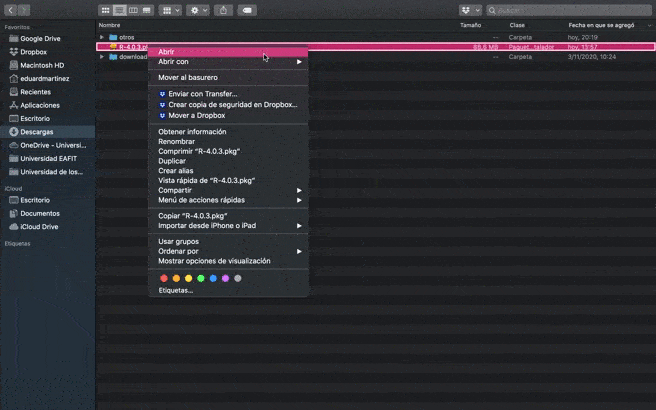
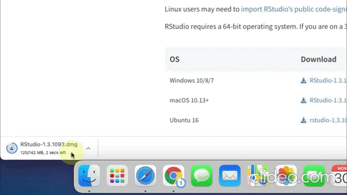
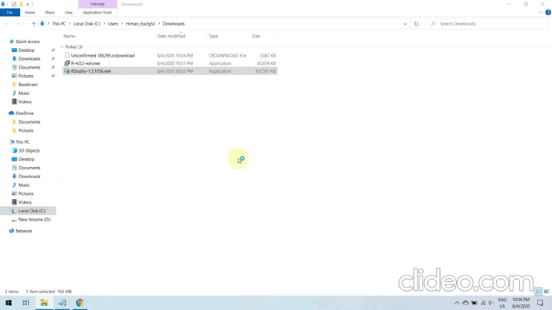
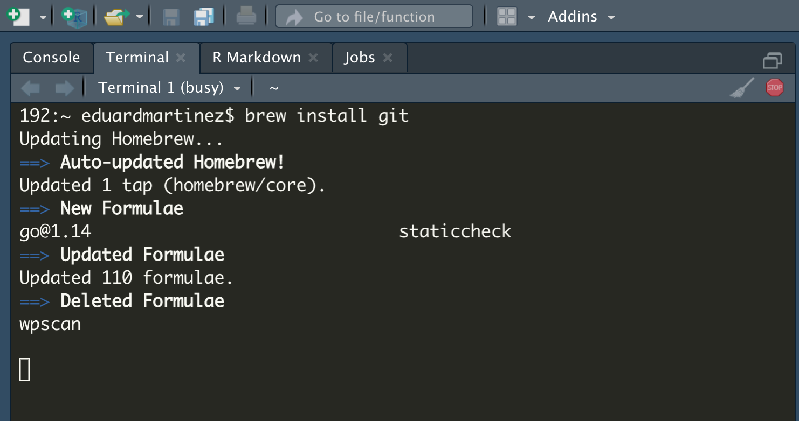
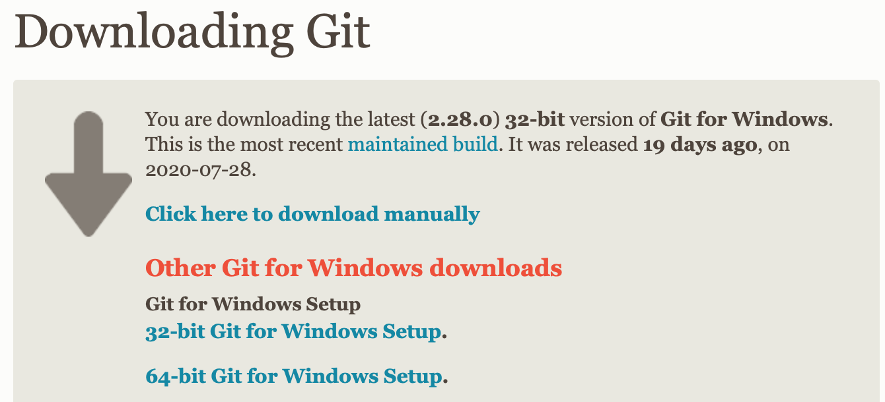

```{r setup, include=FALSE}
# load packages
library(pacman)
p_load(here,knitr,tidyverse,ggthemes)
knitr::opts_knit$set(root.dir = getwd())

# option html
options(htmltools.dir.version = FALSE)
opts_chunk$set(fig.align="center", fig.height=4 , dpi=300 , cache=T)
```


## Hoy veremos

* [[1.] Prólogo]()

* [[2.] Syllabus]()

* [[3.] ¿Usar R?]()

* [[4.] Configuración inicial]()
   
  * [4.1.] Instalar R y Rstudio
     
  * [4.2.] Instalar Git
     
  * [4.3.] Configurar Git


<!--------------------->
<!---    Prólogo    --->
<!--------------------->

# [1.] Prólogo
<html><div style='float:left'></div><hr color='#000099' size=3px width=850px></html>

<!--------------------->
## Acerca del curso

* **GitHub:** [https://github.com/taller-R](https://github.com/taller-R)

* **Slack:** [https://slack.com](https://slack.com/intl/es-co/)

* **Microsoft Teams:** [Equipo de trabajo Taller de R, ECON-1302](https://www.microsoft.com/es-co/microsoft-teams/download-app)

* **Horario de clases:** Miércoles de 05:00 PM - 06:15 PM

* **Horario de atención:** Viernes de 03:00 PM - 04:00 PM

<!--------------------->
## Acerca de mí

[Eduard Martinez](https://github.com/eduard-martinez), estudiante doctorado en Economía de la Universidad de los Andes. Puedes ver mi página web [aquí](https://eduard-martinez.github.io).

<p style="color:black"> ef.martinezg@uniandes.edu.co </img></p>

<p><a href="https://twitter.com/emartigo" style="color:black;">   @emartigo</a> </p>
 
<p><a href="https://github.com/eduard-martinez" style="color:black;">   eduard-martinez </a> </p>


<!--------------------->
<!---    Syllabus   --->
<!--------------------->
# [2.] Syllabus

<html><div style='float:left'></div><hr color='#000099' size=3px width=850px></html>

<p align="center"> Puedes encontrar el programa completo del curso [aquí](https://github.com/taller-R/taller-R/blob/master/ECON_1302_01_Eduard_Martinez.pdf)
</p>

<!--------------------->
## Objetivo 

Este curso busca promover el uso de lenguajes de programación de código abierto (open source), familiarizando al estudiante con el entorno de trabajo de R e introduciendo a los estudiantes en algunos métodos computacionales aplicados en la investigación económica.

<!--------------------->
## Organización del curso

El curso está dividido en 6 módulos:

* **Módulo 1:** Introducción al entorno de trabajo de R
* **Módulo 2:** Tidyverse
* **Módulo 3:** Loops y funciones
* **Módulo 4:** Regresiones
* **Módulo 5:** GIS en R
* **Módulo 6:** Otras aplicaciones

<!--------------------->
## Evaluación

| Componente                          | Peso |
|:-|-:|
| Task 1 (Módulos 1, 2) | 30% |
| Task 2 (Módulo 3) | 15% |
| Task 3 (Módulos 4, 5, 6) | 40% |
| Participación activa en el curso: | 15% |

<!--------------------->
## Fechas importantes

* **Inicio de clases:** 9 de agosto.
* **Semana de receso:** 4-9 de octubre.  
* **Fecha de entrega del 30% de las notas en MiBanner:** 15 de octubre.
* **Último día de clases:** 4 de diciembre.
* **Último día para solicitar retiros:** 17 de diciembre.
* **Último día para subir notas finales en MiBanner:** 16 de diciembre. 

<!--------------------->
## Cuando completes este curso...

<div align="center">
</img>
</div>


<!--------------------->
<!---    Usar R?    --->
<!--------------------->
# [3.] ¿Usar R?
<html><div style='float:left'></div><hr color='#000099' size=3px width=850px></html>

R es un entorno de programacion libre que fue desarrollado en el año 1993 por Robert Gentleman y Ross Ihaka del Departamento de Estadística de la Universidad de Auckland.

<!--------------------->
## ¿Por qué usar R? (cont...)

```{r, eval = T , include=T , echo = F}
pop_df =  data.frame( lang = c("SQL", "Python", "R", "SAS", "Matlab", "SPSS", "Stata"),
                      n_jobs = c(107130, 66976, 48772, 25644, 11464, 3717, 1624),
                      free = c(T, T, T, F, F, F, F))

### Plot it
pop_df %>%  mutate(lang = lang %>% factor(ordered = T)) %>%
            ggplot(aes(x = lang, y = n_jobs, fill = free)) +
            geom_col() + geom_hline(yintercept = 0) +
            aes(x = reorder(lang, -n_jobs), fill = reorder(free, -free)) +
            xlab("Statistical language") + scale_y_continuous(label = scales::comma) +
            ylab("Number of jobs") +
            labs( title = "Comparing statistical languages", subtitle = "Number of job postings on Indeed.com, 2019/01/06" , caption = "Tomado de: https://github.com/uo-ec607") +
            scale_fill_manual( "Free?", labels = c("True", "False"), values = c("#f92672", "darkslategray")) + theme(legend.position = "bottom") 
```

Ver: [*The Popularity of Data Science Software*](http://r4stats.com/articles/popularity/).

<!--------------------->
## ¿Por qué usar R? (cont...)

- **Ideal para la ciencia de datos**

  - Ver: [*The Impressive Growth of R*](https://stackoverflow.blog/2017/10/10/impressive-growth-r/)

- **Open-source (free!)**

  - Puedes descargarlo, instalarlo y usarlo sin ningun costo.
  - Colaboradores en la academia y en la industria.
  - Más de 17.000 librerías disponibles.

- **Múltiples bases de datos**

  - Puedes trabajar con multiples bases de datos al mismo tiempo en diferentes objetos.

<!--------------------->
## ¿Por qué usar R? (cont...)

- **Lenguaje orientado a objetos** (pronto entenderemos mejor esto)

  - Todo es un objeto

  - Todo tiene un nombre

- **Librerías y funciones**

  - Se usan funciones para crear, editar, transformar o eliminar objetos.  

  - La mayoría de las funciones que vamos a necesitar ya fueron escritas por otros colaboradores en paquetes o librerías que debemos "llamar" cada vez que se vayan a usar.

<!--------------------->
<!--- Configuración --->
<!--------------------->

# [4.] Configuración inicial

<html><div style='float:left'></div><hr color='#000099' size=3px width=850px></html>

<!--------------------->
## Descargar softwares

- Descargar [R](https://cran.r-project.org/)

- Descargar [RStudio](https://www.rstudio.com/products/rstudio/download/preview/)

  - RStudio es un entorno de desarrollo integrado (IDE) para el lenguaje de programación R. En un lenguaje más practico, Rstudio brinda una interfaz más amigable que R, brindando una experiencia de aprendizaje más placentera.

- Descargar [Git](https://git-scm.com/downloads)

- Crear una cuenta de [GitHub](https://github.com/join?ref_cta=Sign+up&ref_loc=header+logged+out&ref_page=%2F&source=header-home)

- Configurar [Git](https://eduard-martinez.github.io/blog/github/clonar_github.html)

<!--------------------->
## Instalar R (Mac)

Version 4.0.3. para [MAC](https://cran.r-project.org/bin/macosx/)



<!--------------------->
## Instalar R (Windows)

Version 4.0.3. para [Windows](https://cran.r-project.org/bin/windows/base/) o [Linux](https://cran.r-project.org)


<!--------------------->
## Instalar RStudio (Mac)



<!--------------------->
## Instalar RStudio (Windows)


<!--------------------->

## Isntalar Git (Mac)

* Ir a la terminal de su equipo (puede hacerlo desde Rstudio) e instalar [Homebrew](https://brew.sh/index_es) (seguir instrucciones). 

* Después que termina de instalarse *Homebrew*, usted puede instalar **Git** copiando y pegando esta linea de código en la terminal:
`brew install git`



<!--------------------->

## Instalar Git (Windows)

Debe descargar el instalador de [git bash](https://git-scm.com/download/win) (Git for Windows Setup de 32-bit o 64-bit), hacer clic en instalar y seguir las instrucciones de instalación.




<!--------------------->
## Configurar la cuenta de Git en el equipo

Ir a la CMD o terminal de su equipo y ejecutar los siguientes comandos:

```{bash eval=FALSE}
git config --global user.name 'Escribe tu usuario de GitHub'
```


```{bash eval=FALSE}
git config --global user.email 'Escribe tu correo de GitHub'
```


```{bash eval=FALSE}
git config --global user.password "Escribe tu contraseña de GitHub"
```

<!--------------------->
<!--- Checklist --->
<!--------------------->
# Gracias
<html><div style='float:left'></div><hr color='#000099' size=3px width=850px></html>

<!--------------------->
## Hoy vimos...

☑ Instalamos R

☑ Instalamos RStudio

☑ Instalamos Git

☑ Configuramos nuestra cuenta de GitHub en nuestro equipo


<!--- HTML style --->
<style type="text/css">
.reveal .progress {background: #CC0000 ; color: #CC0000}
.reveal .controls {color: #CC0000}
.reveal h1.title {font-size: 3.0em;color: #CC0000; font-weight: bolde}
.reveal h1.subtitle {font-size:2.0em ; color:#000000}
.reveal section h1 {font-size:2.0em ; color:#CC0000 ; font-weight:bolder ; vertical-align:middle}
.reveal section h2 {font-size:1.8em ; color:#CC0000 ; font-weight:bolde ; text-align:left}
.reveal section h3 {font-size:1.5em ; color:#00000 ; font-weight:bolde ; text-align:left}
.reveal section h4 {font-size:1.3em ; color:#00000 ; font-weight:bolde ; text-align:left}
.reveal section p {font-size:0.9em ; color:#00000 ; text-align:left}
.reveal section a {font-size:0.9em ; color:#000099 ; text-align:left}
.reveal ul {list-style-type:disc ; font-size:1.1em ; color:#00000 ; display: block;}
.reveal ul ul {list-style-type: square; font-size:0.9em ; display: block;}
.reveal ul ul ul {list-style-type: circle; font-size:0.9em ; display: block;}
</style>