```{r setup, include=FALSE}
# load packages
library(pacman)
p_load(here,knitr,tidyverse,ggthemes)
knitr::opts_knit$set(root.dir = getwd())

# option html
options(htmltools.dir.version = FALSE)
opts_chunk$set(fig.align="center", fig.height=4 , dpi=300 , cache=T)
```

# Hoy veremos

* [[1.] R y Rstudio](#github)

  * [1.1.] Interfaz

  * [1.2.] Sintaxis

  * [1.3.] Librerías

* [[2.] Git y GitHub]()

   * [2.1.] Qué es Git y GitHub?
   
   * [2.2.] Flujo de trabajo

* [[3.] Clonar un repositorio]()

<!--------------------->
<!--- Configuración --->
<!--------------------->

# [1.] R y Rstudio

<html><div style='float:left'></div><hr color='#000099' size=3px width=850px></html>

[RStudio](https://rstudio.com) es un entorno de desarrollo integrado (IDE) para el lenguaje de programación [R](https://www.r-project.org). En un lenguaje más practico, Rstudio brinda una interfaz más amigable que R, permitiendo una experiencia de aprendizaje más placentera.

<!--------------------->
## Workflow en R

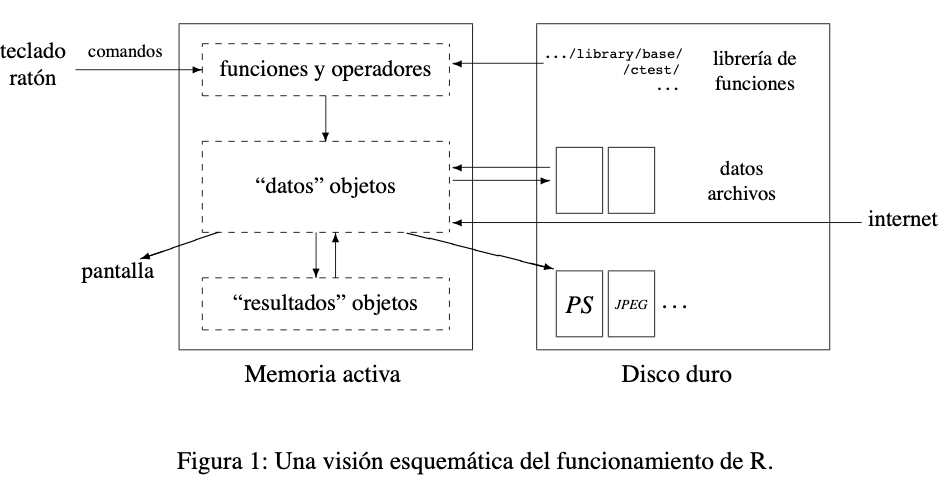

Tomado de: R para principiantes.

<!--------------------->
## Interfaz R

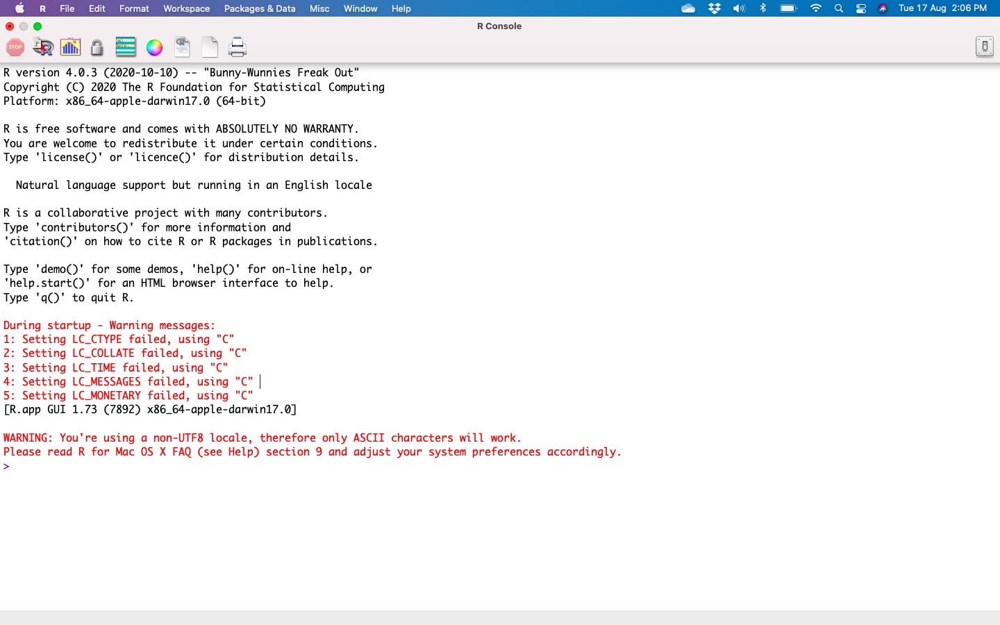
<!--------------------->

## Interfaz Rstudio

<div align="center">

</div>
Tomado de: [https://2.bp.blogspot.com](https://2.bp.blogspot.com)

<!--------------------->
## Cambiar la apariencia de Rstudio

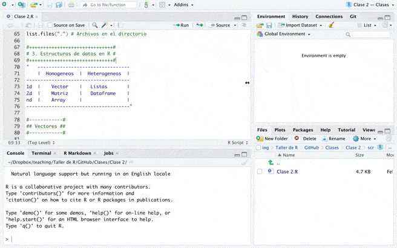

<!--------------------->
## Sintaxis en R

Como crear un objeto debes:

```{bash eval=FALSE}
nombre_objeto + asignar + funcion()
```

* Una forma de hacerlo: 

```{bash eval=FALSE}
datos <- rnorm(n = 10 , mean = 50 , sd = 10)
```

* Otra forma de hacerlo: 

```{bash eval=FALSE}
data = rnorm(n = 10 , mean = 40 , sd = 10)
```

<!--------------------->
## Entorno de R:

El entorno de trabajo de R almacena temporalmente los objetos que se crean durante una sesión. El espacio de trabajo puede ser guardado o no al momento de cerrar la sesión. 

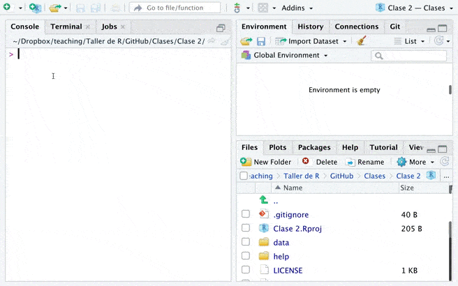

<!--------------------->
## Funciones:

Las funciones permiten crear, editar, transformar o eliminar objetos. Estan contenidas en librerías. Y cada función contiene alemnos 1 argumento.

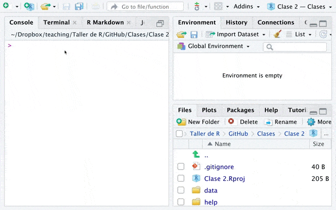
* Agregar captura con información de sessionInfo
* Agregar capture con funcion ejecutandose  (cuando aparece stop sobre la consola)

<!--------------------->

## Decoding messages

Estas notificaciones se muestran sobre la consola y pueden generarse después de aplicar una función.

* [Warning]() y [message](): sugiere que hay detalles de la función que debemos tener en cuenta (no se detiene la ejecución de la función).

* [Error](): se genera cuando ocurrió un error importante causando que la función no continue ejecutándose.

<div align="center">
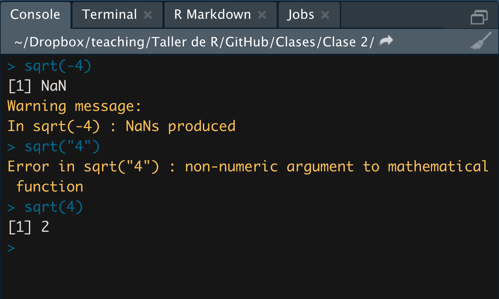
</div>

* Agregar capture con comando no terminaod (cuando aparece + en la consola)

<!--------------------->

## Editor de sintaxis:

<small>El editor de código o editor de sintaxis nos permite escribir las instrucciones que queremos ejecutar en R. Para ejecutarlas debemos sombrear toda la linea que queremos ejecutar y orpimir las teclas [Control]() + [Enter]() o haciendo clik en [run](). </small>

<div align="center">
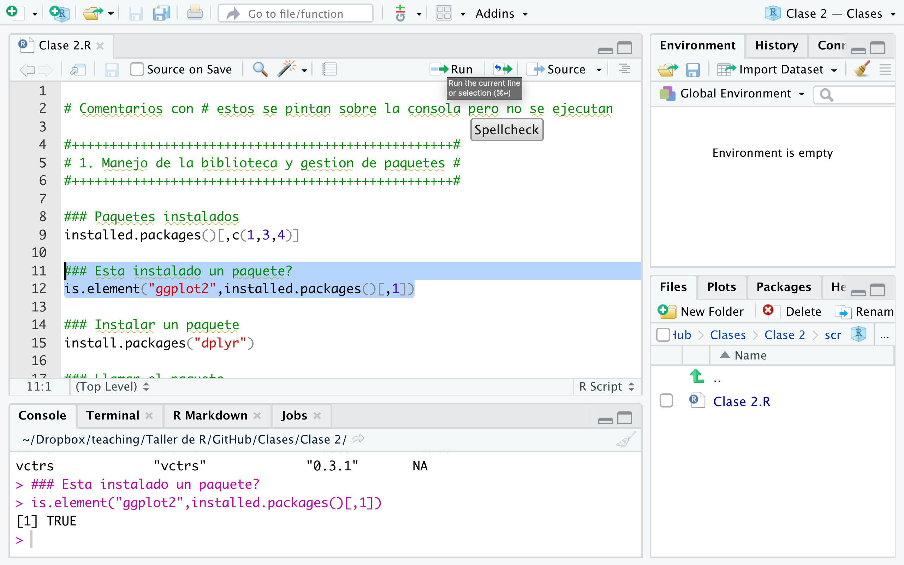
</div>

<!--------------------->
## Librerías

Em R se pueden gestionar más de 17.000 librerías disponibles en el cran y otras miles más disponibles en GitHub. Para gestionar las librerias en R debemos:

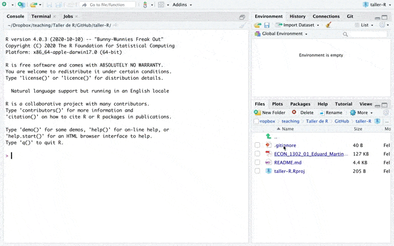

<!--------------------->
<!---    gitHub    --->
<!--------------------->

# [2.] Git y GitHub

<html><div style='float:left'></div><hr color='#000099' size=3px width=850px></html>

<!--------------------->
## Qué es Git?

- Git es un sistema de control de versiones distribuido. 

- Bien, intente esto: Imagínese si Dropbox y la función "Seguimiento de cambios" en MS Word tuvieran un bebé. Git sería ese bebé.

- De hecho, es incluso mejor que eso porque Git está optimizado para las cosas en las que los economistas y los científicos de datos pasan mucho tiempo trabajando (por ejemplo, el código).

- Hay una curva de aprendizaje, pero les prometo que vale la pena.


<!--------------------->
## ... y GitHub?

- Es importante darse cuenta de que Git y GitHub son cosas distintas.

- GitHub es una plataforma de alojamiento en línea que proporciona una variedad de servicios integrados en el sistema Git. (Las plataformas similares incluyen Bitbucket y GitLab).

<!--------------------->
## Workflow en GitHub

<div align="center">

</div>

<!--------------------->
## Trabajo colaborativo en GitHub

<div align="center">
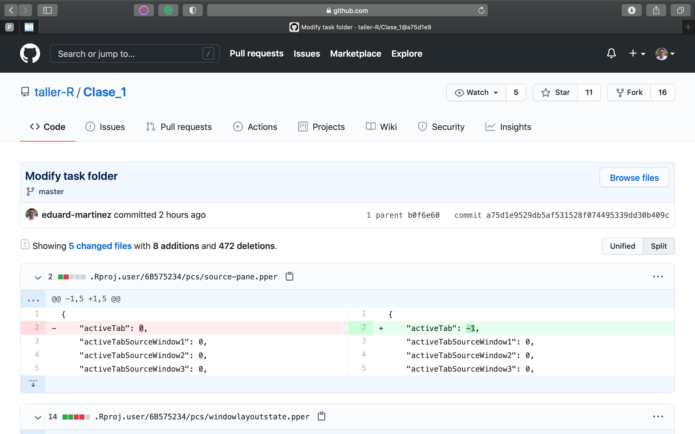
</div>

<!--------------------->
## Trabajar en un repositorio de GitHub

<div align="center">

</div>

<!--------------------->
## Antes de trabajar en un repositorio local..

<div align="center">

</div>

<!--------------------->
## Después de trabajar en un repositorio local..

<div align="center">

</div>

<!--------------------->
## Usando Git...

<div align="center">

</div>

<!--------------------->
<!--- Clonar un repositorio --->
<!--------------------->

# [3.] Clonar un repositorio

<html><div style='float:left'></div><hr color='#000099' size=3px width=850px></html>

<!--------------------->

## Crear un repositorio en GitHub

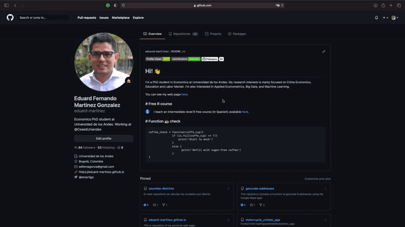

<!--------------------->

## Crear un proyecto en Rstudio (...)

**☑** Si el repositorio no está en tu cuenta, puedes crear una copia en tu cuenta (fork), para que puedas editarlo.

**☑** Copiar el enlace HTTPS

**☑** Abrir una sesión de Rstudio

**☑** Crear una versión de control de Git en tu equipo

**☑** Abrir el proyecto

<!--------------------->

## Crear un proyecto en Rstudio (...)

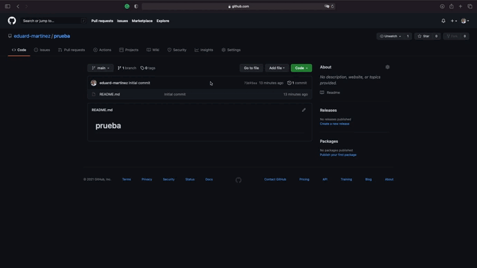

<!--------------------->

## De mi repositorio local a GitHub (...)

Primero seleccionamos los archivos que queremos subir a  GitHub. Para eso escribimos sobre la temrinal:

```{bash eval=FALSE}
git add -A
```

Posteriormente se etiqueta los cambios hechos en un comentario:

```{bash eval=FALSE}
git commit -m "Escribir comentario"
```

Finalmente se suben los cambios al repositorio online:

```{bash eval=FALSE}
git push
```

<!--------------------->

## De mi repositorio local a GitHub (...)


<!--------------------->
<!---    Hoy vimos  --->
<!--------------------->

# Gracias
<html><div style='float:left'></div><hr color='#000099' size=3px width=850px></html>


<!--------------------->
##  Hoy vimos...

☑ Interfaz de Rstudio

☑ Decoding messages en RStudio

☑ Sintaxis de R

☑ Librerías

☑ Flujo de trabajo en Git


<!--- HTML style --->
<style type="text/css">
.reveal .progress {background: #CC0000 ; color: #CC0000}
.reveal .controls {color: #CC0000}
.reveal h1.title {font-size: 3.0em;color: #CC0000; font-weight: bolde}
.reveal h1.subtitle {font-size:2.0em ; color:#000000}
.reveal section h1 {font-size:2.0em ; color:#CC0000 ; font-weight:bolder ; vertical-align:middle}
.reveal section h2 {font-size:1.6em ; color:#CC0000 ; font-weight:bolde ; text-align:left}
.reveal section h3 {font-size:1.5em ; color:#00000 ; font-weight:bolde ; text-align:left}
.reveal section h4 {font-size:1.3em ; color:#00000 ; font-weight:bolde ; text-align:left}
.reveal section p {font-size:0.9em ; color:#00000 ; text-align:left}
.reveal section a {font-size:0.9em ; color:#000099 ; text-align:left}
.reveal ul {list-style-type:disc ; font-size:1.1em ; color:#00000 ; display: block;}
.reveal ul ul {list-style-type: square; font-size:0.9em ; display: block;}
.reveal ul ul ul {list-style-type: circle; font-size:0.9em ; display: block;}
</style>
