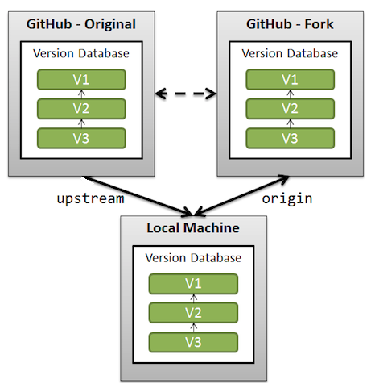

```{r setup, include=F , cache=F}
# load packages
library(pacman)
p_load(here,knitr)

# option html
options(htmltools.dir.version = FALSE)
opts_chunk$set(fig.align="center", fig.height=4 , dpi=300 , cache=F)
```

## Hoy veremos

### **[1.]** Preparar repositorio

### **[2.]** Directorio de trabajo y entorno de R

### **[3.]** Tipo de datos 

### **[4.]** Estructuras de datos en R


<!----------------------------->
<!--- Directorio de trabajo --->
<!----------------------------->

# [1.] Sincronizar el repositorio

<html><div style='float:left'></div><hr color='#000099' size=3px width=850px></html>

<!----------------------------->
## Git pull origin (...)



Tomado de:[https://stackoverflow.com/questions](https://stackoverflow.com/questions/3903817/pull-new-updates-from-original-github-repository-into-forked-github-repository)

<!----------------------------->
## Git pull origin (...)

Ver documentación de git [aquí](https://docs.github.com/en/get-started/quickstart/fork-a-repo)

```{r,eval=F,include=T}
# Ver repositorios remotos configurados
git remote -v

# Agregar la ruta al repositorio de origen
git remote add upstream https://github.com/count_otigin/repo_origin.git

# Ver los nuevos repositorios remotos
git remote -v

# actualizar cambios
git fetch upstream
git merge upstream/main
```

<!----------------------------->
<!--- Directorio de trabajo --->
<!----------------------------->

# [2.] Directorio de trabajo

<html><div style='float:left'></div><hr color='#000099' size=3px width=850px></html>

Es la ubicacion dentro de nuestro equipo en la que se encuentran los archivos que podemos importar (directamente) archivos del disco duro a R y exportar (directamente) objetos de R al disco duro.

<!----------------------------->
## Inspeccionar el WD?

```{r,eval=F,include=T}
# obtener la ruta del directorio de trabajo actual
getwd() 

# obtener vector nombres de archivos en el wd
list.files() 

# vector nombres archivos markdown (.xls)
list.files(path = '.' , pattern = '.xls') 

# Establecer un nuevo directorio de trabajo
setwd('ruta al nuevo directorio de trabajo') 
```

<!----------------------------------------------------------------------------->
<!----------------------------- Tipo de datos --------------------------------->
<!----------------------------------------------------------------------------->

# [3.] Tipo de datos

<html><div style='float:left'></div><hr color='#000099' size=3px width=850px></html>

<!----------------------->
<!----Tipo de datos------>
<!----------------------->
## Tipo de datos

En R encontramos estos datos en formato `logical`, `integer`, `numeric` (o `double`), `complex`, `character` y `raw`.


```{r,eval=T,include=T}
# lógico
vector_l = c(NA,TRUE,FALSE)
is.logical(vector_l)

# character
vector_c = c("hola",'a') #para character se usa '' o ""
is.character(vector_c)
```

<!--------------------->

## Datos numericos

```{r,eval=T,include=T}
# numeric
vector_n = c(5,2)
is.numeric(vector_n)

# interger
vector_i = -5:5
is.integer(vector_i)
```

<!--------------------->

## Datos numericos

```{r,eval=T,include=T}
# double
vector_d = c(1e6,2e6)
is.double(vector_d)
```
puedo consultar el tipo de datos que contiene un objeto usando la función `is()`.

<!----------------------------------------------------------------------------->
<!---------------------------Estructuras de datos------------------------------>
<!----------------------------------------------------------------------------->

# [4.] Estructura de datos
<html><div style='float:left'></div><hr color='#000099' size=3px width=850px></html>

## Estructura de datos

| Dimensiones | Homogéneos	|  Heterogéneos  |
|:-|-:|-:|
| 1d          |  Vector    |   Listas       |
|             |            |                |
| 2d          |  Matriz    |   Dataframe    |
|             |            |                |
| nd          |  Array     |                |


- **Homogéneos:** todos los elementos de este objeto deben ser del mismo tipo (númerico o carácter o lógico).

- **Heterogéneos:** este tipo de objetos permiten almacenar diferentes tipos de datos (númerico, carácter y lógico).

- **Dimensiones:** hace referencia al numero de dimensiones (filas y/o columnas) de un objeto.

<!--------------------->

## Vector & Matriz

```{r,eval=T,include=T}
# Vectores
abe = c("a","b","c","d","e","f")
log = c(TRUE,FALSE,TRUE,TRUE,FALSE,FALSE)
num = c(2,4,6,7,8,9) # los numeros no tiene que ser continuos

# Matriz
matriz = matrix(num, ncol = 3,  nrow = 2 )
matriz
```

Observemos que los datos de la matriz provienen de los datos del vector

<!--------------------->

## Listas 
```{r,eval=T,include=T}
#lista              
lista = list()
lista[[1]] = abe
lista[[2]] = log
lista[[3]] = num
lista[[4]] = matriz # matriz que creamos anteriormente
lista
```
Las listas son como una carpeta de computador, esta puede tener diferentes documetos dentro de ella. 

<!--------------------->

## Dataframes
```{r,eval=T,include=T}
#dataframe
dataframe = data.frame(log, abe, num, matriz) 

dataframe 
```
la matiz se triplico para mantener la misma cantidad de filas, veremos mas tarde como evitar esto. 

<!--------------------->

## Manipular matrices

* Observar elementos dentro de una matriz
```{r,eval=T,include=T}

matriz[1,]# todos los elementos en fila 1


matriz[,2] # todos los elementos en columna 2


matriz[1,2] # elemento en fila 1 y columna 2
```

<!--------------------->

## Manipular matrices

* Remplazar elemento 
```{r,eval=T,include=T}
# Remplazar elementos en una fila
matriz[1,] = c(3,7,9)
matriz

# remplazar un elemento
matriz[1,2] = 5
matriz
```

<!--------------------->

## Manipular matrices

* Observar nombre de filas y clumnas
```{r,eval=T,include=T}
colnames(matriz) # nombre de columnas 

rownames(matriz) # nombre de fillas
```
No name = NULL 

<!--------------------->

## Manipular matrices

* Asignar nombre a columnas y filas  

```{r,eval=T,include=T}
# Asignar nombre a varias columnas
colnames(matriz) = c("Col 1" , "Col 2", "col 3") 
matriz

# Asignar nombre a una fila en especifico
rownames(matriz)[2] = "row 2" 
matriz
```

<!--------------------->

## Manipular dataframes

* Las matrices son similares a los dataframes
```{r,eval=T,include=T}
dataframe[1,]# observar una fila

# cambiar los nombre de la filla
rownames(dataframe) = c("row 1","row 2","row 3","row 4","row 5","row 6") 

rownames(dataframe)# observar los nombres de las fillas
```

<!--------------------->

## Manipular listas

* las listas son similares a las matrices, solo con un paso extra. 
```{r,eval=T,include=T}

lista[[4]] # LLamamos el dato que deseamos

lista[[4]][,2] # seleccionar columna dentro de la matiz
```

<!--------------->
<!--- Gracias --->
<!--------------->

# Gracias
<html><div style='float:left'></div><hr color='#000099' size=3px width=850px></html>

<!--------------------->
##  Hoy vimos...

☑ Directorio de trabajo y entorno de R

☑ Tipo de datos 

☑ Estructuras de datos en R


<!--- HTML style --->
<style type="text/css">
.reveal .progress {background: #CC0000 ; color: #CC0000}
.reveal .controls {color: #CC0000}
.reveal h1.title {font-size: 2.4em;color: #CC0000; font-weight: bolde}
.reveal h1.subtitle {font-size:2.0em ; color:#000000}
.reveal section h1 {font-size:2.0em ; color:#CC0000 ; font-weight:bolder ; vertical-align:middle}
.reveal section h2 {font-size:1.4em ; color:#CC0000 ; font-weight:bolde ; text-align:left}
.reveal section h3 {font-size:1.1em ; color:#00000 ; font-weight:bolde ; text-align:left}
.reveal section h4 {font-size:1.0em ; color:#00000 ; font-weight:bolde ; text-align:left}
.reveal section h5 {font-size:0.9em ; color:#00000 ; font-weight:bolde ; text-align:left}
.reveal section p {font-size:0.7em ; color:#00000 ; text-align:left}
.reveal section a {font-size:0.8em ; color:#000099 ; text-align:left}
.reveal section div {align="center";}
.reveal ul {list-style-type:disc ; font-size:1.0em ; color:#00000 ; display: block;}
.reveal ul ul {list-style-type: square; font-size:0.8em ; display: block;}
.reveal ul ul ul {list-style-type: circle; font-size:0.8em ; display: block;}
</style>

