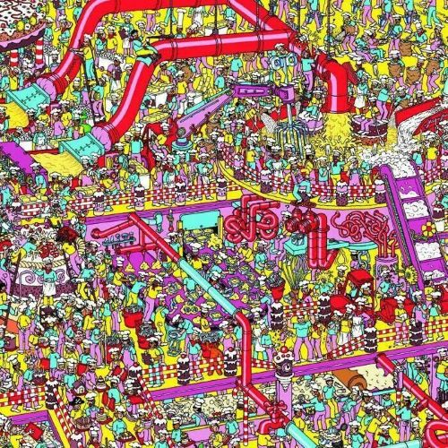
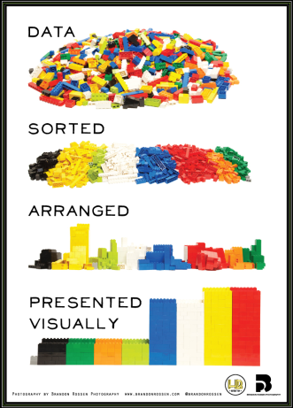
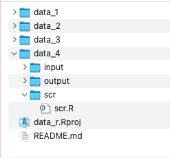
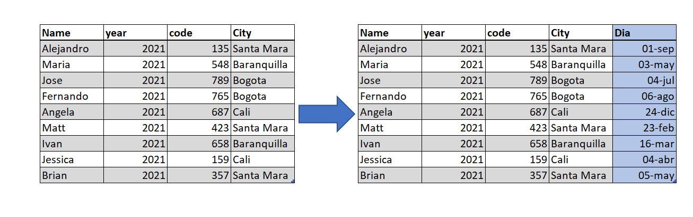
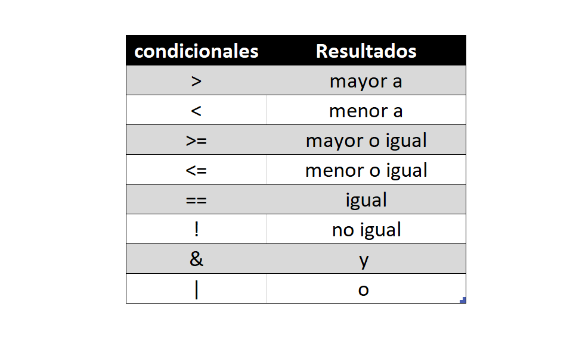

```{r setup, include=F , cache=F}
# load packages
library(pacman)
pacman::p_load(rio,readxl,haven,skimr,WriteXLS,tidyverse,here,knitr,ggthemes)
opts_chunk$set(fig.align="center", fig.height=4 , dpi=300 , cache=F) # chunk options
```

## Hoy veremos

### **[1.]** Diferencia entre tidy y raw data

### **[2.]** Importar & Exportar (librerías readxl, haven, WriteXLS)

### **[3.]** Importar & Exportar (librería rio)

### **[4.]** Operador pipe (%>%)

### **[5.]** Crear variables

<!----------------------------------------------------------------------------->
<!------------------- Diferencia entre tidy y raw data  ----------------------->
<!----------------------------------------------------------------------------->

# [1.] Diferencia entre tidy y raw data
<html><div style='float:left'></div><hr color='#000099' size=3px width=850px></html>

<!------------------------------>
## Dirty data es como waldo. 



Imagen tomada de: [pinterest](https://www.pinterest.pt/pin/543598617520389402/)

<!------------------------------>
## Mas facil cuando esta limpia


Imagen tomada de: [pinterest](https://www.pinterest.pt/pin/370632244341806100/)

<!------------------------------>
## De raw data a tidy data



Imagen tomada de: [pinterest](https://www.pinterest.pt)

<!------------------------------>
## Workflow data



Flujo de trabajo de [Human Rights Data Analysis Group](https://hrdag.org/2016/06/14/the-task-is-a-quantum-of-workflow/)

<!----------------------------------------------------------------------------->
<!---- 2. importar & exportar base de datos; readxl, haven, WriteXLS ---------->
<!----------------------------------------------------------------------------->

# [2.] Importar & Exportar (librerías readxl, haven, WriteXLS)
<html><div style='float:left'></div><hr color='#000099' size=3px width=850px></html>

<!------------------------------>
<!--------- 2.1 Import --------->         
<!------------------------------>

## Importar  

- Estas funciones nos permiten importar y exportar bases de datos.

| File_type   | Importar	 |   Exportar     |
|:-|-:|-:|
|.csv         |  read.csv()  |   write.csv()  |
|             |              |                |
|.xls & .xlsx | read_excel() |   WriteXLS()   |
|             |              |                |
|.dta         |  read_dta()  |   write_dta()  |
|             |              |                |
|RDS          |  readRDS()   |    saveRDS()   |


## EJ: Importar
- Importar base de datos en formato .dta
```{r}
data_dta = read_dta(file = "data/input/Area - Caracteristicas generales (Personas).dta") 
```
```{r echo=FALSE}
data_dta %>%  head(1) %>%  mutate(P6020 = ifelse(test = P6020 == 1, yes = "hombre", no = "mujer")) %>% select(directorio,secuencia_p,P6020,P6050)
```
- Importar base de datos en formato .Rdata
```{r}
load(file = "data/input/Homicidios 2020.Rdata")
```
```{r echo=FALSE}
data_rdata %>%  head(1) %>%  select(departamento, municipio, mes, `armas medios`)
```

<!------------------------------>
<!--------- 2.2 Exportar ------->         
<!------------------------------>

## EJ: Exportar

- Exportar base de datos en formato .dta
```{r}
write_dta(data = data_dta ,path = "data/output/Area - Caracteristicas generales (Personas).dta") 
```

- Exportar base de datos en formato .Rdata
```{r}
save(data_rdata,data_dta,file = "data/output/Datos.Rdata")
```

<!------------------------------>
## Algunos argumentos

Muchos de estas funciones utilizan los mismos argumentos. 

- file = "". Direccion de directorio

- sep(",") = Permite separar las filas por el argumento.

- skip = #. En cual fila se debe comenzar a leer.

- sheet = #. Cual hoja se debe leer.

- header = T/F. Están los nombres de las columnas presentes.

- skipNul = T/F. Se debe aceptar los no elementos.


<!----------------------------------------------------------------------------->
<!---------------- [3.] importar & Exportar con; rio -------------------------->
<!----------------------------------------------------------------------------->

# [3.] Importar & Exportar (librería rio)
<html><div style='float:left'></div><hr color='#000099' size=3px width=850px></html>

<!------------------------------>
## Importar 

- Rio es un package que simplifica el proceso de importación, exportación  e incluso conversion entre formatos.

| File_type   | Importar	|   Exportar  |
|:-|-:|-:|
|.csv         |  Import()  |   export()  |
|             |            |             |
|.xls & .xlsx |  Import()  |   export()  |
|             |            |             |
|.dta         |  Import()  |   export()  |
|             |            |             |
|RDS          |  Import()  |   export()  |

<!------------------------------>
<!------ 3.1  Importación ------>         
<!------------------------------>
## EJ: Importar

- Importación en formato .csv
```{r}
data_csv = import(file = "data/input/censo 2018.csv", skip = 6) 
```

```{r echo= FALSE}
data_csv %>% rename("codigo_divipola"= `Código DIVIPOLA`, "poblacion_en_hogares" = `Población en hogares particulares`, "Poblacion_en_lea" = `Población en LEA` ) %>% select(codigo_divipola, `NOMBRE DEPARTAMENTO`, poblacion_en_hogares, Poblacion_en_lea ) %>% head(2) 
```

- Importación en formato .xls
```{r}
data_xls = import(file = "data/input/hurto-personas-2020_0.xlsx", skip = 9)
```
```{r echo= FALSE}
data_xls %>% select(DEPARTAMENTO, MUNICIPIO, MES, `ARMAS MEDIOS` ) %>% head(2) 
```

<!------------------------------>
<!---- 3.2  Exportación -------->         
<!------------------------------>
## EJ: Exportacion

- Exportacion en formato .csv 
```{r}
export(x = data_csv, file = "data/output/data_csv.csv")
```

- Exportacion en formato .xls 
```{r}
#export(x = data_xls, file = "data/output/data_xls.xlsx")
```

- Le indicamos a la función en que formato queremos que se exporte con .rds, .xlsx, ...
```{r}
export(x = "data_xls", file = "data/output/data_xls_in_rds.rds")
```

<!------------------------------>
<!------ 3.3  Convertir -------->         
<!------------------------------>
## Convertir

- Convert es la combinación de las dos ultimas seciones, esta permite cambiar un file a .xlsx, .rds, .csv, ...


convert(in_file = "file path.csv" , out_file = "file path.xlsx")

convert(in_file = "file path.xlsx" , out_file = "file path.rds")

<!------------------------------------>
<!-------- 3.4 head & skimr ---------->         
<!------------------------------------>
## 3.4 head & skimr

- head(), nos permite ver las primeras filas de los datos, es lo que hemos utilizado hasta el momento para ver los datos. 
```{r}
data_xls %>% select(DEPARTAMENTO, MUNICIPIO, MES, `ARMAS MEDIOS` ) %>% head(1) 

```

## 
- skim() nos da un resume de la informacion
```{r echo= FALSE}
data_xls %>% select(DEPARTAMENTO, MUNICIPIO, MES) %>% skim() 

```
  
<!----------------------------------------------------------------------------->
<!------------------------- 4. operador pipe (%>%) ---------------------------->
<!----------------------------------------------------------------------------->

# [4.] Operador pipe (%>%)
<html><div style='float:left'></div><hr color='#000099' size=3px width=850px></html>

## ¿que es pipe?

Pipe es un conector para las funciones dplyr, este nos permite conectar varias funciones. 

Shortcut:

- Cmd + Shift + M -> (para Mac)

- Ctrl + Shift + M -> (para windows)

Informacion extra: [Pipe](https://rsanchezs.gitbooks.io/rprogramming/content/chapter9/pipeline.html)

Informacion extra: [funciones dplyr](https://rsanchezs.gitbooks.io/rprogramming/content/chapter9/dplyr.html)

<!------------------------------>
<!-------- 4.1 sin pipe -------->         
<!------------------------------>

## datos originales

 mtcars, datos instalados en la memoria de r
```{r echo= FALSE}
mtcars %>% select(mpg, cyl, disp, hp, drat, wt, qsec) %>%  head(6)
```

## Funciones sin pipe

seleccionamos unas filas y las arreglamos en forma descendente 
```{r}
mtcars2 = slice(mtcars, 1:3) # selecionamos filas 1:3
mtcars2 = arrange(mtcars2, desc(disp)) # arreglar de mayor a menor segun la variable disp 
mtcars2 = filter(mtcars2, disp == 160) ## disp = 160
```

resultados
```{r echo= FALSE}
mtcars2 %>% select(mpg, cyl, disp, hp, drat, wt, qsec)
```

<!------------------------------>
<!-------- 4.2 con pipe -------->         
<!------------------------------>
## Funciones con pipe

Pipe permite disminuir las vesces que se llama la base de datos mtcars y ahorrar lineas de texto
```{r}
mtcars3 = mtcars %>% slice( 1:3) %>% 
   arrange(desc(disp)) %>% 
   filter(disp == 160)
```

resultados
```{r echo= FALSE}
mtcars3 %>% select(mpg, cyl, disp, hp, drat, wt, qsec)
```
<!----------------------------------------------------------------------------->
<!--------------------------- 5. crear variables ------------------------------>
<!----------------------------------------------------------------------------->

# [5.] Crear variables
<html><div style='float:left'></div><hr color='#000099' size=3px width=850px></html>

## Agregar variables

Podemos agregar y quitar variables de dos maneras, con " $ " una función bases de R o " mutate() " función de dplyr. 



<!------------------------------>
<!-------- 5.1 data$var -------->         
<!------------------------------>
## 5.1 data$var

Utilizando la base de datos mtcars, podemos agregar e eliminar columnas. 
```{r}
mtcars$codigo = paste(mtcars$vs,mtcars$am,mtcars$gear,mtcars$carb) # agregamos columnas

mtcars$vs = NULL # Eliminamos columnas
mtcars$am = NULL
mtcars$gear = NULL
mtcars$carb = NULL
```

```{r echo= FALSE}
mtcars %>% head(5)
```
<!------------------------------>
<!-- 5.2 mutate | condiconales ->         
<!------------------------------>

## 5.2 mutate | rnorm | condicionales 

podemos obtener el mismo resultado con mutate, pipe, & select:

```{r}
data("mtcars")
mtcars = mtcars %>% mutate(codigo = paste(vs, am, gear,carb)) %>% select(!c(vs, am, gear, carb))
```


```{r echo= FALSE}
mtcars %>% head(5)
```


##  rnorm    

- rnorm() crea un vector de números aleatorios. 

```{r}
# combinamos con round para obtener 0 digtos despues del punto
round(rnorm(10, mean = 10, sd = 5), digits = 0)
```

- rnorm() con una variable. 

```{r}
x = 10
round(rnorm(x, mean = 10, sd = 5), digits = 0)
```

## condicionales 

- Hint por eso el titulo.



<!------------------------------>
<!-- 5.3 mutate & condiconales ->         
<!------------------------------>

## 5.3 mutate & rnorm  & condiconales 

- Utilizaremos la base de datos iris, viene en la memoria de r. 
```{r echo=FALSE}
iris
```

## mutate & rnorm

- Creamos un vector random
```{r }
# numero aleatorio. utilizo las filas de iris como el vector de numeros
ran = round(rnorm(nrow(iris), mean = 10, sd = 5), digits = 1)
```

```{r echo=FALSE}
# numero aleatorio. utilizo las filas de iris como el vector de numeros
head(ran, 10)
```

- Creamos una nueva columna
```{r }
# nueva columna con numeroa aleatorio
 iris %>% mutate(r_num = ran) %>%  head( 5)
```


## mutate & rnorm  & condiconales

EJ 1: Usando rnum para filtrar iris
```{r }
# filtramos por species == c("virginica" o "setosa") y el numero ran 15 <= # >=10. 
iris %>%
   mutate(r_num = ran) %>% 
   filter( Species == "virginica" | Species == "setosa" & r_num >= 10 & r_num <= 15 ) %>%
   select(!c(Sepal.Length)) # para visualizar la tabla mejor
```

## mutate & condiconales

EJ 2: Usando condicionales para crear nuevas varaibles de iris

```{r }
iris %>%  # copiamos los anchos de (setosa) a su propia columna 
  mutate(setosa.p.w = ifelse(test = Species =="setosa", yes = Petal.Width, no = NA)) %>%
  # copiamos los anchos que no sean (setosa y versicolor) a su propia columna
  mutate(virginica.p.w = ifelse(test = Species !="setosa" & Species !="versicolor", yes = Petal.Width, no = NA))%>% 
  # para visualizar la tabla mejor
   select(!c(Sepal.Length, Sepal.Width,Petal.Length)) 
```


 

<!----------------------------------------------------------------------------->
<!----------------------------    hoy vimos    -------------------------------->
<!----------------------------------------------------------------------------->
#  Hoy vimos...

☑ Diferencia entre tidy y raw data

☑ importar & Exportar con; readxl, haven, WriteXLS

☑ importar & Exportar con; rio

☑ Operador pipe ( %>% )

☑  Crear variables


<!--- HTML style --->
<style type="text/css">
.reveal .progress {background: #CC0000 ; color: #CC0000}
.reveal .controls {color: #CC0000}
.reveal h1.title {font-size: 2.4em;color: #CC0000; font-weight: bolde}
.reveal h1.subtitle {font-size:2.0em ; color:#000000}
.reveal section h1 {font-size:1.8em ; color:#CC0000 ; font-weight:bolder ; vertical-align:middle}
.reveal section h2 {font-size:1.4em ; color:#CC0000 ; font-weight:bolde ; text-align:left}
.reveal section h3 {font-size:1.1em ; color:#00000 ; font-weight:bolde ; text-align:left}
.reveal section h4 {font-size:1.0em ; color:#00000 ; font-weight:bolde ; text-align:left}
.reveal section h5 {font-size:0.9em ; color:#00000 ; font-weight:bolde ; text-align:left}
.reveal section p {font-size:0.7em ; color:#00000 ; text-align:left}
.reveal section a {font-size:0.8em ; color:#000099 ; text-align:left}
.reveal section div {align="center";}
.reveal ul {list-style-type:disc ; font-size:1.0em ; color:#00000 ; display: block;}
.reveal ul ul {list-style-type: square; font-size:0.8em ; display: block;}
.reveal ul ul ul {list-style-type: circle; font-size:0.8em ; display: block;}
</style>


